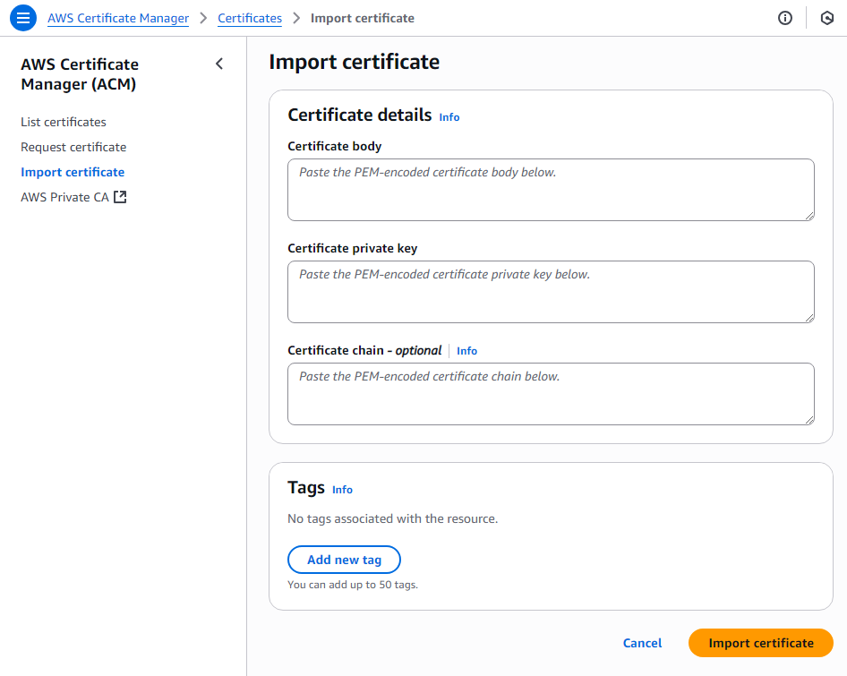

# AWS S3 버킷과 CloudFront로 HTTPS 홈페이지 만들기

## 1. SSL 인증서 ACM(AWS Certificate Manager)에 등록하기

**1. PEM 파일 준비하기**
- cert.pem: Certificate
- private.key: Private Key
- cert-chain.pem: Certificate Chain(Optional)
  
**2. Certificate Manager에 등록하기**
- AWS Certificate Manager (ACM) 이동
- Import certificate
- Certificate body: cert.pem 내용 붙여넣기
- Certificate private key: private.key 내용 붙여넣기
- Certificate chain - optional: cert-chain.pem 내용 붙여넣기


**3. 팁**
- 만약 cert.pem 파일에 인증서가 여러 개 등록되어 있는 경우 (Certificate Chain인 경우)
- 첫 번째 인증서 블록을 복사하여 cert.pem 파일로 저장
- 나머지 인증서 블록을 복사하여 cert-chain.pem 파일로 저장

**4. AWS CLI 명령어로 인증서 업로드하는 방법**
- AWS CloudShell 실행
- 인증서 파일 업로드 후 아래 명령어 실행

```
aws acm import-certificate \
--certificate fileb://cert.pem \
--private-key fileb://private.key \
--certificate-chain fileb://cert-chain.pem \
--region us-east-1
```

## 2. S3 버킷 생성

